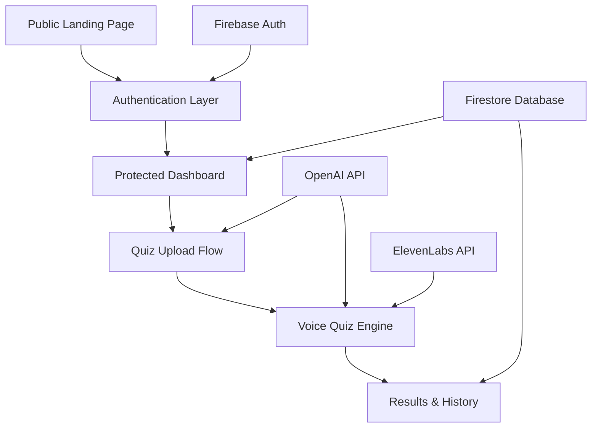

# Design Document

## Overview

This design document outlines the architecture for transforming Mentorak v2 into a complete product with authentication, user management, and persistent quiz history. The application will use Next.js 14 App Router with Firebase for authentication and data storage, maintaining the existing PDF-to-voice-quiz core functionality while adding comprehensive user features.

## Architecture

### High-Level Architecture



### Application Flow

1. **Public Access**: Unauthenticated users see landing page with product demo
2. **Authentication**: Users sign up/login via Firebase Auth
3. **Dashboard**: Authenticated users access personalized dashboard with history
4. **Quiz Creation**: Users upload PDFs, system generates MCQs via OpenAI
5. **Voice Interaction**: Users take quizzes using voice input/output
6. **Persistence**: All quiz data saved to user's Firestore profile
7. **History & Results**: Users can review past quizzes and detailed results

## Components and Interfaces

### Route Structure

```
/app
├── (public)/
│   ├── page.tsx                 # Landing page (unauthenticated)
│   └── layout.tsx               # Public layout
├── login/
│   └── page.tsx                 # Firebase login form
├── signup/
│   └── page.tsx                 # Firebase signup form
├── dashboard/
│   └── page.tsx                 # User dashboard (protected)
├── upload/
│   └── page.tsx                 # PDF upload & MCQ generation (protected)
├── quiz/
│   └── page.tsx                 # Voice quiz session (protected)
├── result/
│   └── page.tsx                 # Current quiz results (protected)
├── history/
│   ├── page.tsx                 # Quiz history list (protected)
│   └── [id]/
│       └── page.tsx             # Individual quiz result details (protected)
└── layout.tsx                   # Root layout with auth provider
```

### Core Components

#### Authentication Components
- `AuthProvider`: Context provider for Firebase auth state
- `ProtectedRoute`: HOC for route protection
- `LoginForm`: Email/password login with Firebase
- `SignupForm`: User registration with Firebase
- `useAuth`: Custom hook for auth state management

#### Dashboard Components
- `DashboardStats`: Summary statistics (total quizzes, avg score)
- `RecentQuizzes`: List of recent quiz attempts
- `QuickActions`: Upload PDF and navigation buttons

#### Quiz Components
- `PDFUploader`: File upload with validation
- `MCQGenerator`: Interface for OpenAI MCQ generation
- `VoiceQuizSession`: Voice-enabled quiz interface
- `QuestionCard`: Individual question display with voice controls
- `ResultsSummary`: Quiz completion results
- `HistoryTable`: Paginated quiz history display

#### Shared Components
- `Navigation`: App navigation with auth-aware menu
- `LoadingSpinner`: Consistent loading states
- `ErrorBoundary`: Error handling wrapper
- `VoiceControls`: Reusable voice input/output controls

### Data Models

#### User Model
```typescript
interface User {
  uid: string;
  email: string;
  displayName?: string;
  createdAt: Timestamp;
  lastLoginAt: Timestamp;
}
```

#### Quiz Model
```typescript
interface Quiz {
  id: string;
  userId: string;
  title: string;
  createdAt: Timestamp;
  completedAt?: Timestamp;
  score: number;
  totalQuestions: number;
  questions: Question[];
  responses: UserResponse[];
  pdfFileName: string;
  status: 'in_progress' | 'completed';
}

interface Question {
  id: string;
  text: string;
  options: string[];
  correctAnswer: number;
  audioUrl?: string; // ElevenLabs TTS URL
}

interface UserResponse {
  questionId: string;
  selectedAnswer: number;
  isCorrect: boolean;
  responseTime: number;
  voiceTranscript?: string;
}
```

### API Integration Layer

#### Firebase Services
```typescript
// lib/firebase/auth.ts
export const signUp = (email: string, password: string) => Promise<User>
export const signIn = (email: string, password: string) => Promise<User>
export const signOut = () => Promise<void>
export const getCurrentUser = () => User | null

// lib/firebase/firestore.ts
export const createQuiz = (userId: string, quiz: Partial<Quiz>) => Promise<string>
export const updateQuiz = (quizId: string, updates: Partial<Quiz>) => Promise<void>
export const getUserQuizzes = (userId: string) => Promise<Quiz[]>
export const getQuizById = (quizId: string) => Promise<Quiz>
```

#### External API Services
```typescript
// lib/openai/mcq-generator.ts
export const generateMCQsFromPDF = (pdfText: string) => Promise<Question[]>

// lib/openai/voice.ts
export const transcribeAudio = (audioBlob: Blob) => Promise<string>

// lib/elevenlabs/tts.ts
export const generateSpeech = (text: string) => Promise<string> // Returns audio URL
```

## Error Handling

### Error Categories

1. **Authentication Errors**
   - Invalid credentials
   - Network connectivity issues
   - Firebase service unavailable

2. **File Upload Errors**
   - Invalid file format
   - File size limits
   - PDF parsing failures

3. **API Integration Errors**
   - OpenAI API rate limits
   - ElevenLabs quota exceeded
   - Network timeouts

4. **Database Errors**
   - Firestore write failures
   - Permission denied
   - Offline state handling

### Error Handling Strategy

```typescript
// lib/error-handler.ts
export class AppError extends Error {
  constructor(
    message: string,
    public code: string,
    public userMessage: string
  ) {
    super(message);
  }
}

export const handleApiError = (error: unknown): AppError => {
  // Centralized error processing
  // Return user-friendly error messages
  // Log technical details for debugging
}
```

### User Experience for Errors
- **Toast notifications** for temporary errors
- **Inline validation** for form errors
- **Retry mechanisms** for network failures
- **Graceful degradation** when services unavailable
- **Offline indicators** when Firebase disconnected

## Testing Strategy

### Unit Testing
- **Components**: React Testing Library for UI components
- **Hooks**: Custom hooks testing with renderHook
- **Services**: Mock Firebase and external APIs
- **Utilities**: Pure function testing

### Integration Testing
- **Authentication Flow**: Login/signup/logout sequences
- **Quiz Flow**: PDF upload → MCQ generation → voice quiz → results
- **Database Operations**: Firestore CRUD operations
- **API Integration**: OpenAI and ElevenLabs service calls

### End-to-End Testing
- **User Journeys**: Complete user flows from landing to quiz completion
- **Cross-browser**: Chrome, Firefox, Safari compatibility
- **Mobile Responsive**: Touch and voice interactions on mobile
- **Performance**: Page load times and API response times

### Testing Tools
- **Jest**: Unit test runner
- **React Testing Library**: Component testing
- **Cypress**: E2E testing
- **Firebase Emulator**: Local Firebase testing
- **MSW**: API mocking for tests

## Security Considerations

### Authentication Security
- Firebase Auth handles password hashing and session management
- JWT tokens for API authentication
- Automatic token refresh
- Secure logout with token invalidation

### Data Protection
- Firestore security rules restrict user data access
- PDF files processed server-side, not stored permanently
- Voice recordings processed but not permanently stored
- User data encrypted in transit and at rest

### API Security
- OpenAI and ElevenLabs API keys stored in environment variables
- Rate limiting on API endpoints
- Input validation for all user data
- CORS configuration for allowed origins

## Performance Optimization

### Frontend Performance
- **Code Splitting**: Route-based code splitting with Next.js
- **Image Optimization**: Next.js Image component for assets
- **Caching**: React Query for API response caching
- **Bundle Analysis**: Regular bundle size monitoring

### Backend Performance
- **PDF Processing**: Server-side processing to avoid client load
- **Audio Caching**: Cache TTS audio files to reduce API calls
- **Database Indexing**: Firestore indexes for query optimization
- **CDN**: Static assets served via CDN

### Voice Performance
- **Audio Streaming**: Stream TTS audio for faster playback
- **Voice Recognition**: Optimize Whisper API calls
- **Offline Fallback**: Text input when voice unavailable
- **Audio Compression**: Optimize audio file sizes

## Deployment Architecture

### Environment Configuration
- **Development**: Local Firebase emulators
- **Staging**: Firebase staging project
- **Production**: Firebase production project with monitoring

### CI/CD Pipeline
1. **Code Quality**: ESLint, Prettier, TypeScript checks
2. **Testing**: Unit, integration, and E2E test suites
3. **Build**: Next.js production build
4. **Deploy**: Vercel deployment with environment variables
5. **Monitoring**: Error tracking and performance monitoring

### Monitoring & Analytics
- **Error Tracking**: Sentry for error monitoring
- **Performance**: Web Vitals tracking
- **Usage Analytics**: Firebase Analytics for user behavior
- **API Monitoring**: Track OpenAI and ElevenLabs usage